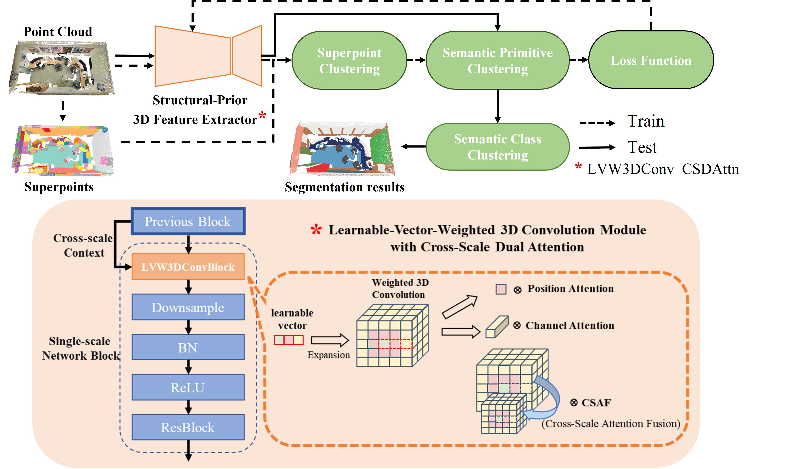

# lvwConv_csdattn
code of An Unsupervised Point Cloud Segmentation Model Guided by Controllable 3D Priors Convolution

Our code builds on [GrowSP](https://github.com/vLAR-group/GrowSP/). Many thanks to PointCept for a great framework.
